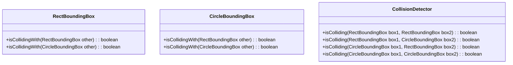

\
\
\
\
\
\
\
\
\
\
&#8203;
# <center>BuontyHunter</center>
### <center>Da un idea di Fabio Fattori , Mattia Senni , Francesco Tonelli e Alessandro Buono</center>
\
\
\
\
\
\
\
\
\
\
&#8203;
# Indice

- [Analisi ](#analisi)
    - [1. Requisiti](#1-requisiti)
      - [1.1 Requisiti Funzionali](#11-requisiti-funzionali)
      - [1.2 Requisiti Non Funzionali](#12-requisiti-non-funzionali)
    - [2. Analisi e Modello del Dominio ](#2-analisi-e-modello-del-dominio)
- [Design ](#design)
    - [1. Architettura ](#1-architettura)
    - [2. Design dettagliato ](#2-design-dettagliato)
        - [Fabio Fattori](#21-fabio-fattori)
        - [Mattia Senni](#22-mattia-senni)
        - [Francesco Tonelli](#23-francesco-tonelli)
        - [Alessandro Buono](#24-alessandro-buono)
        - [Codice riadattato per la realizzazzione](#25-codice-riadattato-per-la-realizzazzione)
- [Sviluppo ](#sviluppo)
    - [1. Testing Automatizzato ](#1-testing-automatizzato)
    - [2. Note di sviluppo ](#2-note-di-sviluppo)
        - [Fabio Fattori](#21-fabio-fattori-sviluppo)
        - [Mattia Senni](#22-mattia-senni-sviluppo)
        - [Francesco Tonelli](#23-francesco-tonelli-sviluppo)
        - [Alessandro Buono](#24-alessandro-buono-sviluppo)
- [Commenti Finali ](#commenti-finali)
    - [1. Autovalutazione e Lavori Futuri ](#1-autovalutazione-e-lavori-futuri)
        - [Fabio Fattori](#21-fabio-fattori-autovalutazione)
        - [Mattia Senni](#22-mattia-senni-autovalutazione)
        - [Francesco Tonelli](#23-francesco-tonelli-autovalutazione)
        - [Alessandro Buono](#24-alessandro-buono-autovalutazione)
    - [2. Difficoltà Incontrate e Commenti per i Docenti ](#2-difficoltà-incontrate-e-commenti-per-i-docenti)
- [Guida Utente ](#guida-utente)

# Analisi

Il software prevede di realizzare una simulazione delle avventure di un cacciatore di taglie, il giocatore prenderà i panni del protagonista, per simulazione si intende che il software dovrà consentire al giocatore di intraprendere missioni , guadagnare ricompense e migliorare il proprio equipaggiamento.

### 1. Requisiti
#### 1.1 Requisiti Funzionali
- Il software dovrà consentire la corretta visualizzazione di un mondo simulato , del giocatore , dei nemici e delle missioni.
- Inoltre il giocatore come i nemici si potranno muovere e attaccare all'interno del mondo simulato , il giocatore si muoverà tramite l'input da parte dell'utente mentre i nemici si muoveranno in modo autonomo.
- Il giocatore potrà attaccare i nemici e i nemici potranno attaccare il giocatore.
- Il software dovrà consentire la corretta visualizzazione di un HUD che mostri la vita, l'arma equipaggiata e i dobloni del giocatore; ed inoltre dovrà implementare un sistema di missioni e ricompense all'adempimento delle stesse.
- Il software dovrà anche fornire un interfaccia utente per la selezione dell'arma e per l'acquisto di nuove armi.

#### 1.2 Requisiti Non Funzionali
- Il software dovrà essere performante , in quanto dovrà essere in grado di gestire un numero elevato di entità all'interno del mondo simulato.
- Il software dovrà essere facilmente estendibile , in quanto dovrà essere possibile aggiungere nuove armi , nuovi nemici e nuove missioni senza dover modificare il codice alla base del gioco.

### 2. Analisi e Modello del Dominio

Il gioco sarà gestito secondo il modello ECB (Entity-Component-System) , il nostro controller dovrà permettere (uno alla volta) all'input di essere processato,alla fisica delle singole entità di essere aggiornata e alla grafica di essere disegnata. Tale Controller prenderà il nome di GameEngine e sarà il gestore/mediatore tra tutte le entità del gioco.
Ogni entità presente nel gioco prenderà il nome di GameObject e sarà composta da un componente che gestirà la fisica , un componente che gestirà la grafica,ed un componente che gestirà l'input.
Pensiamo di trovare particolarmente difficoltosa la gestione della fisica tra i singoli GameObjects e la gestione della grafica , in quanto dovrà essere possibile disegnare ogni singolo GameObject e dovrà essere possibile gestire le collisioni tra loro.


Figura 1: Diagramma UML formato durante l'analisi del dominio, il diagramma mostra le relazioni tra le entità principali del gioco.

# Design 
### 1. Architettura 

L'architettura di Buontyhunter segue il pattern EBC (Entity-Component-System) come può essere visto anche nella figura 2.1:
- Il System è il GameEngine che è il gestore di tutta l'applicazione ,egli infatti permette a tutti i Componenti dei GameObject di aggiornarsi, in particolare dentro al GameEngine è presente il metodo StartGame che fa partire il gameLoop , questo ciclo richiama il metodo redraw(),updatePhysics() e processInput(); ognuno di questi metodi si occupa di chiamare i metodi corrispondenti di ogni GameObject presente .
- Le Entity sono appunti tutte le entità del gioco (GameObjects) , da un GameState che appunto serve per avere sempre una panoramica sullo stato del gioco , quindi se il player è morto oppure è vivo e in quale mondo/World il player si trova , e da un World appunto che contiene tutte le entità del gioco che appartengono al mondo corrente,compreso il player, questo mondo può essere cambiato per dal GameState per simulare un teletrasporto oppure un cambio di zona.
- I Component sono le parti che compongono le Entity , in particolare ogni GameObject ha un GraphicsComponent che si occupa di disegnare il GameObject , un PhysicsComponent che si occupa di gestire la fisica del GameObject , e un InputComponent che si occupa di gestire l'input del GameObject.

### toDo MODIFICARE 


&#8203;
2.1 Diagramma UML che descrive l'architettura del gioco concentrandosi sugli elementi principali che gestiscono i GameObjects


### 2. Design dettagliato 

**Problema** : Come fare a create ogni singolo GameObject che può essere prensente in gioco 

**Soluzione** : Abbiamo deciso di creare una classe chiamata GameFactory (che utilizza il pattern SingleTon) che si occupi di creare ogni singola entità del gioco , questa idea ci consente di avere un unico punto di creazione per ogni singolo GameObject e di poter facilmente aggiungere nuove entità al gioco senza dover modificare il codice alla base del gioco; questa idea ci è venuta vedendo altri programmi di creazione di videogiochi , es. Unity, che permettono appunto di creare qualsiasi entità si vuole tramite un unico punto di creazione.
Il Diagramma UML riportato sotto raffigura un esempio di utilizzo della classe GameFactory , in particolare si può intedere come la classe ChangeWorldEvent si occupi di creare un nuovo mondo chiamando tutti i metodi di cui ha bisogno di GameFactory.
Questo è solo un esempio di utilizzo di GameFactory , in realtà GameFactory può essere utilizzata in qualsiasi parte del progetto per creare qualsiasi entità del gioco.
Nella view (SwingScene) ho fatto in modo di far visualizzare/disegnare , all'apertura del QuestPannel , le missioni disponibili e solo quelle.


&#8203;
2.2 Diagramma UML che descrive l'utilizzo di GameFactory , raffigurando quindi solo i metodi interessati da ChangeWorldEvent, ma GameFactory vanta molti altri metodi, oltre a quelli mostrati

#### 2.1 Fabio Fattori

**Problema** : Come fare a cambiare il mondo in cui si trova il player , per passare da Hub a OpenWorld e viceversa.

**Soluzione** : Ho deciso di creare un Teleporter che estende GameObject , ed in più ha una destinazione , grazie a questo GameObject è possibile cambiare il mondo in cui si trova il player , in particolare quando il player entra in collisione con il Teleporter , il TeleporterPhysicsComponent genera un Evento , più precisamente un ChangeWorldEvent , che tramite il metodo di World notifyWorldEvent(WorldEvent) che chiama il notifyWorldEvent(WorldEvent) di GameEngine viene aggiunto alla coda di eventi, che ogni game loop viene processata e poi pulita. 
In questo caso quindi il GameEngine deve solo chiamare il setWorld(World) di GameState per cambiare il mondo in cui si trova il player.


**Pattern Usato** : ChangeWorldEvent è un esempio di Observer Pattern , in quanto il GameEngine è l'Observer e il World è l'Observable , in particolare il World notifica il GameEngine di un cambiamento di stato tramite il metodo notifyWorldEvent(WorldEvent) , il GameEngine è in ascolto di questo evento e lo processa quando lo riceve.
Inoltre in Swing Scene è presente uno stato , rappresentato da un booleano chiamato isHub , quindi viene utilizzato il pattern State per cambiare lo stato della scena in base a isHub ; stato presente anche in ChangeWorldEvent , dove lo stato è rappresentato dalla destinazione del Teleporter.

&#8203;
2.3 Diagramma UML che descrive il processo di cambio del mondo in cui si trova il player tramite la generazione di un ChangeWorldEvent da parte di un Teleporter.

**Problema** : voglio rendere possibile che il player possa vedere tutta la mappa dell'openworld , grazie ad una minimappa , e che possa vedere le missioni che ha accettato.

**Soluzione** : Ho deciso di creare una classe HidableObject che permette al giocatore di premere un tasto prestabilito e far apparire/scomparire qualcosa sullo schermo.
La minimappa ed il registro delle missioni sono quindi un HidableObject , un HidableObject estende GameObject quindi ha bisogno di un GraphicsComponent che si occupi di disegnare la minimappa e il registro delle missioni , un InputComponent che se il tasto premuto è quello corretto apre e chiude l'HidableObject , e poi un PhysicsComponent che non deve fare nulla perchè questi oggetti non hanno fisica quindi gli assegno NullPhysicsComponent.
Nella View (SwingScene) è presente una classe innestata chiamata ScenePanel che implementa KeyListener e si occupa di settare a true oppure a falso il corrispondente campo booleano di un InputController presente in SwingScene , questo InputController è inizializzato ed usato nel GameEngine per processare l'input.
In questo modo l'HidableObject può essere reso visibile o invisibile a seconda del tasto premuto, a seconda quindi se il valore booleano contenuto in InputController è vero oppure falso.


**Pattern Usato** : NullPhysicsComponent è un PhysicsComponent che non fa nulla , è il pattern comportamentale NullObject che permette di evitare di dover fare controlli su null.

**Problema** : come fare ad implementare il sistema delle missioni , in particolare come fare a far si che il player possa accettare una missione nell'hub e poi completarla nell'openworld.

**Soluzione** : Ho deciso di creare una classe chiamata PlayerEntity che estende FighterEntity , in questo modo posso aggiungere ad una FigherEntity una lista di Quest , in particolare ogni Quest ha un metodo start() e end() che vengono chiamati quando il player accetta una missione e quando la missione viene completata.
Le missioni vengono create dalla GameFactory e vengono rese disponibili da un QuestPannel che è un HidableObject che si occupa di disegnare le missioni disponibili e di far si che il player possa accettarle.
Fatto ciò dovevo trovare un modo per rendere visualizzabile l'HidableObject e quindi ho deciso di creare una nuova classe chiamata InterractableArea che estende GameObject e che ha un HidableObject come attributo , in questo modo posso rendere visualizzabile l'HidableObject quando il player entra in collisione con l'InteractableArea e preme un il tasto E.
Ho deciso di fare InteractableArea il più generale possibile per poterla utilizzare in futuro per rendere visualizzabili altre schermate come la schermata del fabbro creata da Tonelli Francesco.


**Problema** : Come differenziare i gameObject che possono essere interagiti da quelli che non possono esserlo, in particolare come fare a far si che il player possa interagire con un "NPC" sono quando è vicino ad esso.

**Soluzione** : Ho deciso di creare una classe chiamata InterractableArea che estende GameObject , in particolare questa classe ha un attributo di tipo HidableObject ed un attributo di tipo GameObject, in questo modo posso rendere visualizzabile l'HidableObject quando il player entra in collisione con l'hitbox del GameObject e preme il tasto E.
L'interractable area è quindi un GameObject che ha un HidableObject come attributo , in particolare l'HidableObject è un pannello che si occupa di disegnare le missioni disponibili e di far si che il player possa accettarle; oppure un pannello che si occupa di far si che il player possa comprare munizioni o riparare l'arma.
Quindi in base a se il giocatore è sopra un InterractableArea e preme il tasto E , l'HidableObject viene reso visibile o invisibile; se invece il giocatore è sopra un InterractableArea e non fa niente viene disegnata solo la scritta "premi E per interagire".
La SwingScene si occupa di disegnare l'HidableObject e di farlo apparire e scomparire in base al tasto premuto, ed inoltre di far apparire i bottoni corrispondenti al pannello aperto.


**Problema** : avere dei GameObject che possano eseguire degli attacchi e distinguere i nemici dal player.

**Soluzione** : Ho deciso di creare una classe chiamata FighterEntity che estende GameObject , in particolare questa classe ha un attributo di tipo Weapon , in questo modo posso rendere possibile che un GameObject possa eseguire degli attacchi. Inoltre FigherEntity ha un attributo di tipo FighterEntityType che mi permette di distinguere i nemici dal player , in particolare il player ha un FighterEntityType di tipo PLAYER mentre i nemici hanno un FighterEntityType di tipo ENEMY, grazie a questo campo i nemici non possono fare danno ad altri nemici ma solo al player e viceversa.
Quindi i FighterEntity hanno anche una vita , una vita massima (questo permette anche al player di recuperare vita), ed una damaging area (vedi parte di Alessandro Buono).


#### 2.2 Mattia Senni
**Problema**:
La necessità di determinare quali oggetti disegnare, la loro posizione e decidere se renderli visibili o meno, in base alla posizione del giocatore all'interno del mondo simulato, ha presentato una sfida.

**Soluzione** (Insieme a Fabio Fattori):
Abbiamo affrontato questa sfida implementando un algoritmo nella classe SwingScene insieme a una nuova classe dedicata chiamata Camera. Quest'ultima contiene metodi che permettono di valutare se un oggetto è attualmente in scena, basandosi sulle coordinate interne del nostro gioco, e fornisce le coordinate di rendering convertendo le coordinate in pixel nella vista della camera.
Questi metodi hanno permesso di ottimizzare il processo di rendering, evitando di disegnare oggetti che non sono attualmente visibili nella vista del giocatore e determinando con precisione dove posizionare gli oggetti visibili.

Questo approccio ha contribuito significativamente all'ottimizzazione delle prestazioni del gioco e alla gestione efficiente della visualizzazione degli oggetti in base alla posizione del giocatore nel mondo simulato.


**Problema**:
Era necessario implementare un sistema per gestire e caricare le mappe del gioco, risolvendo i numeri presenti nei file delle mappe con i relativi tipi di tile e caricando le immagini corrispondenti.

**Soluzione**:
Ho creato la classe TileManager, che contiene una lista di Tile con al suo interno una variabile contenente un enumerativo dell'immagine da utilizzare, per memorizzare l'immagine ho utilizzato un'istanza di ImageAssetProvider per risolvere il tipo di tile e ottenere la path dell'immagine corrispondente. La classe SwingGraphics utilizza la Camera per determinare dove disegnare i tile nella finestra e utilizza l'ImagePathProvider per risolvere il percorso dell'immagine da caricare.
Il sistema permette di caricare mappe, risolvere i tipi di tile e disegnarli correttamente sulla finestra di gioco utilizzando la camera per la posizione corretta. L'ImagePathProvider è fondamentale per ottenere le path delle immagini da utilizzare in SwingGraphics e per poter separare la logica dalla grafica.
Il tileManager conosce sempre la mappa corrente e le sue dimensioni tramite la ReactBoundingBox, ovvero rappresenta un rettangolo


**Problema**:
La necessità di implementare un algoritmo di Pathfinding per consentire ai nemici di determinare il percorso più efficiente per raggiungere il giocatore in ogni momento del gioco.

**Soluzione**:
Ho affrontato questo problema sviluppando due algoritmi di Pathfinding distinti: ASTAR Pathfinding (implementato grazie ad una base dell'algoritmo fornito da ChatGPT(https://chat.openai.com/)) e BFS Pathfinding. Questi algoritmi sono stati implementati attraverso una classe Pathfinder, e per fornire un approccio flessibile, abbiamo introdotto una Pathfinder Factory. Quest'ultima consente di creare dinamicamente gli algoritmi di Pathfinding necessari in base alle esigenze del gioco.
Per garantire che i nemici si muovano efficacemente verso il giocatore, abbiamo creato una classe AIPathfinderHelper, che, attraverso il metodo MoveItem, consente a un oggetto (come un nemico) di conoscere il prossimo passo ottimizzato per avvicinarsi al giocatore. Inoltre, la classe AIEnemyPathfinder è stata introdotta per gestire il movimento degli avversari in modo da non raggiungere direttamente il giocatore, ma piuttosto affrontarlo in modo strategico.

Questa soluzione ha migliorato notevolmente il comportamento degli avversari nel gioco, rendendoli più intelligenti e capaci di navigare in modo efficiente verso il giocatore in ogni situazione.


**Pattern utilizzati**:
- Factory Patter: per il factory dei path finder
- Strategy Patter: per dare il path finder da usare al AIPathFinder Helper


**Problema**:
La necessità di implementare un sistema di collisioni nel gioco per determinare se due elementi, come oggetti o nemici, si scontrano all'interno della mappa.

**Soluzione**:
Per gestire le collisioni, ho introdotto due tipi di bounding box: RectBoundingBox e CircleBoundingBox, che rappresentano rispettivamente un quadrato e un cerchio. Inoltre, ho creato una classe denominata CollisionDetector.
La classe CollisionDetector fornisce quattro metodi: isColliding, ciascuno dedicato a gestire la collisione tra tipi specifici di bounding box. Questi metodi restituiscono un valore booleano, indicando se i due elementi stanno collidendo nella mappa.
L'utilizzo di bounding box di forma diversa fornisce una flessibilità maggiore nel gestire collisioni tra oggetti con geometrie differenti. Questa soluzione ha garantito un rilevamento accurato delle collisioni nel gioco, contribuendo a una simulazione più realistica e interattiva.



**Problema**:
Era necessario implementare un sistema di spawn dei nemici nel mondo del gioco e gestire il processo di creazione di nemici in modo dinamico.

**Soluzione**:
Per affrontare questa esigenza, all'interno della classe World ho inserito un EnemyRegistry. Quest'ultimo è responsabile di gestire il processo di spawn dei nemici, consentendo o impedendo la creazione in base alle condizioni di gioco.
Ho creato una classe EnemySpawner come interfaccia di base, dalla quale ho derivato una classe specifica chiamata EnemySpawnerFromDistance. Quest'ultima, eseguita ad ogni frame, calcola tramite una probabilità se i nemici devono essere creati. Il metodo spawn aggiunge al world , il cui numero e tipo sono determinati in base a questa probabilità.
L'utilizzo dell'EnemyRegistry permette di mantenere una gestione centralizzata dei nemici, che possono essere aggiunti alla lista interna dell'EnemyRegistry una volta creati dalla classe di spawn.
Questa soluzione ha fornito un sistema flessibile e dinamico per la creazione dei nemici nel gioco, permettendo di regolare dinamicamente la presenza di nemici in base a determinate condizioni o probabilità.
L'enemyRegistry dispone anche di interfacce per eliminare i nemici o mettere in pausa lo spawn


**Problema**:
Era necessario implementare un sistema per gestire gli attacchi degli enemy e del boss, definendo quando dovrebbero attaccare in base a determinati fattori, tra cui il tempo trascorso dall'ultimo attacco e una probabilità.

**Soluzione**:
Ho introdotto la classe AttackHelper, che è utilizzata sia da Enemy che da Boss. Questa classe mantiene informazioni come il tempo dell'ultimo attacco, l'intervallo di attacco desiderato, la probabilità di attacco di base e un moltiplicatore di probabilità.
Il metodo canAttack calcola se un attacco dovrebbe essere effettuato in base al tempo trascorso dall'ultimo attacco e ad una probabilità esponenziale data dal tempo medio di attacco di ogni entità. Questo sistema permette di modellare dinamicamente la frequenza degli attacchi in modo realistico, adattabile ed imprevedibile.
L'utilizzo di AttackHelper consente una gestione centralizzata degli attacchi, garantendo un approccio coerente sia per gli enemy che per il boss ed inoltre rispetta a pieno il principio di DRY.


**Problema**:
Era necessario implementare un boss, il WizardBossEntity, con due tipi di attacco: uno con una spada e l'altro tramite lo spawn di nemici. Inoltre, il boss deve agire in modo intelligente, attaccando solo quando vicino al giocatore, e deve seguire una logica ben definita per cui all'inizio del gioco si crea in un punto casuale e si muove casualmente sullo schermo, una volta vicino al giocatore tenderà ad attaccarlo.

**Soluzione**:
Ho creato la classe WizardBossEntity, che eredita da FighterEntity e utilizza un'istanza di AttackHelper per determinare quando attaccare o quando spawnare. Il boss ha anche un'istanza di EnemySpawnerFixed, che implementa EnemySpawner e che permette di spawnare tre nemici casuali quando chiamato tramite il metodo spawn.
La classe World gestisce il processo di spawn dei nemici tramite EnemyRegistry. Quando il boss attacca il giocatore, chiama il metodo disableEnemy di World, il quale, a sua volta, chiama il metodo corrispondente in EnemyRegistry per fermare lo spawn dei nemici regolari e inizia a spawnare i nemici del boss attraverso EnemySpawnerFixed, richiamato dal metodo di attacco del boss.


**Problema**:
Mettere in pausa il gioco ogni volta che l'inventario o la mini mappa sono aperti

**Soluzione**:
Dato che inventario e mini mappa sono degli HidableObject, il World tramite il metodo isShow() può sapere in tempo reale e la mini mappa o l'inventario sono aperti.
Grazie a questa strategia nel metodo updateState del World ho inserito un costrutto if che controlla se mini mappa e inventario sono aperti ed in caso affermativo non esegue tutti gli update dei GameObject all'interno del World


**Problema**:
I nemici devono avere un aggiornamento dell'input controllato dall'IA del path finder per potersi muovere esattamente come il player, ma se mini mappa o inventario sono aperti, devono essere bloccati

**Soluzione**:
Ho passato l'oggetto world all'input controller in modo che i nemici possano sempre sapere dove è situato il player, l'input controller dei nemici non verrà eseguito dal game engine come quello del player, ma dal metodo updateState del world in modo che quando inventario o mini mappa sono aperti i nemici rimangano fermi, inoltre i loro movimenti verranno dettati dal path finder utilizzato, in questo caso l'algoritmo scelto è l'AStarPathFinder


#### 2.3 Francesco Tonelli

**Problema** : Comprare le munizioni e riparare le armi

**Soluzione** : Ho creato l'interfaccia Blacksmith, il BlacksmithEntity che la implementa, e il suo BlacksmithPanel con i due bottoni, grafica compresa. Prendendo in considerazione il giocatore, questo fabbro scambia i suoi dobloni con munizioni, o riparando l'arma che tiene in mano (se questa ha una durabiltà). Il Blacksmith entity è un'InterractableArea, a cui il giocatore interagisce, e facendo apparire il suo Panel, da cui accedere alle sue funzionalità. Il panel viene stampato, come gran parte della grafica, da SwingGraphics, richiamata in SwingScene, in questo caso. Viene reso scalabile calcolando le dimensioni attuali dello schermo, e utilizzando delle proporzioni, anche considerando che ogni immagine creata da me è stata disegnata in una griglia 16x16 pixel. Lo stesso metodo l'ho poi utilizzato per rendere ridimensionabili gli sprite della bacheca delle quest di Fattori Fabio.


**Problema** : Modificare lo sprite delle entità in base alle azioni che compiono

**Soluzione**: Ho creato l'enumerativo Direction, che indica in quale delle quattro direzioni è rivolto il personaggio specifico (quindi la FighterEntity), e se è fermo (o sta attaccando) oppure si sta muovendo. Questa direzione viene cambiata al player, quando viene mosso dall'utente, e alle altre entità, quando le muove la IA. Ho creato quindi 12 sprite per ogni personaggio, tre per direzione, uno stazionario e due di movimento. Per alternare questi ultimi, dando l'impressione del movimento, ho inserito, sempre nella FighterEntity, un enumerativo MovementState che indica in quale dei due stati, e quindi dei due fotogrammi, si trova l'entità. Passando poi per SwingPanel, dentro SwingScene, e per SwingGraphics, stampo gli sprite, ottenuti dal sistema AssetImage-ImagePathProvider-ImageType.


**Problema** : Far riprodurre le musiche

**Soluzione** : Una volta prodotte le musiche, ho utilizzato la libreria javax.sound.sampled, e ho creato l'interfaccia MusicPLayer, che contiene un enumerativo Track rappresentante ogni traccia musicale del gioco (in questo caso tre, una per l'hub, una per il world, e l'ultima per il boss), e un metodo per riprodurre una Track (in loop, o finchè non viene fermata dall'apposito metodo. Ogni traccia è stata creata apposta per poter essere messa in loop). Nel mio caso, questa interfaccia viene utilizzata da SwingScene. La difficoltà principale è stata, in questo caso, mettere la musica del boss quando questo entra nell'inquadratura (passando per la Camera).


**Problema** : Creare l'HUD

**Soluzione** : L'HUD viene stampata tutta in SwingScene, facendo uso di SwingGraphics e Graphics2d. Ho riutilizzato una vecchia healthBar che avevamo creato per il testing, l'ho riadattata, e poi ho aggiunto, rendendo scalabile, il display dell'arma equipaggiata, l'eventuale durabilità, i dobloni del giocatore e le sue munizioni. Il tutto è disegnato utilizzando varie proporzioni delle dimensioni del frame.


#### 2.4 Alessandro Buono

**Problema** : Come prendere in input gli attacchi del giocatore

**Soluzione** : Modificando l'interfaccia precedentemente implementata "InputController" mi sono adattato al pattern già utilizzato inserendo però varie funzioni per migliorare la logica e la leggibilità del codice.
L'utilizzo di variabili di stato ha permesso al codice di essere flessibile ed adattabile a varie modifiche sulle interazioni fondamentali che il personaggio ha con gli input, per esempio se il personaggio si può muovere in più direzioni contemporaneamente o se il suo movimento è interrotto se si sta eseguendo un attacco, tutte cose facilmente comprensibili e modificabili nel codice.
Ho fatto in modo che ci sia un timer adattivo in modo da gestire l'attack speed come il numero di attacchi al secondo e così il programma nel lasso di tempo in cui il timer è > 0, ignora completamente i segnali in entrata dalle frecce 

**Pattern usato** : ECS (Entity Component System)

```
classDiagram
    class PlayerInputController {
        - double timer
        - double isAttacking
        -
        + update(GameObject player, InputController c, World w): void
        + instanceAttack(PlayerEntity player, int x, int y): void
        + setTimer(GameObject player): void
        + setDirection(GameObject player, Direction direction ): void
    }

    class InputController {
        //There is a method for each KeyPressed
        + isKeyPressed(): boolean
        
        + anyKeyIsPressedSinceStart(): boolean
    }

    class WeaponDamagingArea {
        // Reference previous implementation
    }

    class GameObject {
        // Reference previous implementation
    }

    class PlayerEntity {
        //Reference previous implementation
    }

    PlayerInputController -->GameObject 
    PlayerInputController -->InputController 
    PlayerInputController -->PlayerEntity 
    PlayerEntity -->WeaponDamagingArea
```


**Problema** : Gestione delle hitbox degli attacchi

**Soluzione** : Risolto impostatando le hitbox come un "HideableObject" in modo da poterne controllare lo stato ed in caso di necessità disattivarlo e poterne cambiarne direzione e dimensione comodamente, questi Object possono interagire con le BBox dei nemici per generare degli eventi alla sovrapposizione, dando effettivamente vita a questo gioco.


**Problema** : Implementazione delle Armi

**Soluzione** : Risolto con dell'ereditarietà standard per minimizzare il riciclo di codice  e permettere a tutte le classi figlie durante tutto il processo della creazione delle armi è risultato molto utile avere certi campi salvati in molteplici oggetti, così da rendere tutto il development più fluido e soprattutto comprensibile.
Spesso può sembrare inutile o subottimale, ma può rispariare tanto tempo quando si cercano dei campi specifici o quando si cerca di risalire ad un errore.
È molto importante però anche considerare il modo in cui i compagni di progetto concepiscono e progettano il codice, perché fare del codice comprensibile per se stessi non vuol dire sempre fare del codice comprensibile per tutti.

```
classDiagram
    class WeaponFactory {
        - WeaponFactory instance
        - WeaponFactory()
        + getInstance(): WeaponFactory
        + createSword(FighterEntity owner): Weapon
        + createBow(FighterEntity owner): Weapon
        + createBossBow(FighterEntity owner): Weapon
        + createBrassKnuckles(FighterEntity owner): Weapon
    }

    class Weapon {
        
        - WeaponType type
        + directAttack()
        + getDamage(): int
        + getAttackSpeed(): double
        + getRange(): int
        + getSpeed(): double
        + getHitbox(): RectBoundingBox
        + getWeaponType(): WeaponType
    }

    class MeleeWeapon {
        - int maxDurability
        - int durability
        + getMaxDurability(): int
        + setDurability(int a): void
        + getDurability(): int
        + directAttack(): void
    }

    class RangedWeapon {
        - Bullet bullet
        - int ammo
        + getShot(): void
        + directAttack(): void
        + setAmmo(int ammo): void
        + subtractAmmo(int ammo): void
        + addAmmo(int ammo): void
        + howManyAmmo(): int
        + getBullet(): Bullet
    }

    class Bullet {
        - double travelDistance
        - Direction attackDirection
        + update(): void
    }

    class FighterEntity {
        //Reference previous implementation
    }


    class WeaponType {
        <<enumation>>
        SWORD
        BOW
        BOSSBOW
        BRASSKNUCKLES
    }


    class WeaponDamagingArea {
        - DamagingArea hitbox
        - Vector2D direction
    }

    class HidableObject{
        boolean show
    }

    WeaponDamagingArea --> HidableObject
    WeaponDamagingArea <--> Weapon
    WeaponFactory --> Weapon : creates
    Weapon <|-- MeleeWeapon
    Weapon <|-- RangedWeapon
    WeaponType --> Weapon
    MeleeWeapon ..> FighterEntity
    RangedWeapon ..> FighterEntity
    RangedWeapon --> Bullet : has
```

**Problema** : Necessità di dare un tipo diverso a stesse istanze di Weapon

**Soluzione** : Creato un ENUM per permettere a svariati altri metodi di capire direttamente la tipologia delle armi riassumendo così molteplici righe di codice e soprattutto rendere molto più facile la gestione degli sprite, soprattutto perché per armi di stessa istanza di weapon non erano riconoscibili avendo un oggetto weapon.


# Sviluppo

### 1. Testing Automatizzato 

I test sono implementati nel file AppTest.java (link di AppTestAggiornato) ed essi verificano il corretto funzionamento dell classe GameEngine, GameFactory, GameState, World , PlayerEntity e Point2d poichè consideriamo queste le classi più importanti del nostro progetto.
Di queste classi si testano :
- GameEngine
    - il costruttore 
    - le variabili statiche
- GameFactory
    - il costruttore
    - il metodo createPlayerEntity
    - il metodo createWorld
    - il metodo createTeleporter
    - il metodo createQuestPannel
- GameState
    - il costruttore
    - il metodo setWorld
    - la gestione del gameOver
    - il metodo notifyWorldEvent
- World
    - il costruttore
    - il metodo notifyWorldEvent
- PlayerEntity
    - il costruttore
    - il metodo addQuest
    - il metodo removeQuest
    - se il metodo getQuests ritorna una copia delle quest
    - controllo se i metodi desposit e withdraw funzionano correttamente
- Point2d
    - l'equals 
    - l'hashCode


### 2. Note di sviluppo

#### 2.1 Fabio Fattori Sviluppo

**Utilizzo di Stream e Lambda expressions**: 
    Usate in tutto il progetto per filtrare e mappare liste di GameObject o di Quest. Quello riportato è un singolo esempio presente nella classe GameEngine.
    Permalink: 


#### 2.2 Mattia Senni Sviluppo

**Utilizzo di Optional**:
Ho utilizzato gli optional in molti metodi che ritornavo oggetti solo se alcune condizioni sono verificate, o in metodi che ritornavo oggetti solo se presente ad esempio a seguente link

**Utilizzo di Stream**:
Ho utilizzato gli stream tutte le volte che avevo bisogno di fare operazioni su una lista, quali scorrimento, filtri o mappatura.

**Utilizzo di Lambda**:
Ho utilizzato le lambda ogni volta che necessitavo di scrivere metodi corti all'intero di filtri o mappature degli stream

**Utilizzo di Java Platform Model System**:
Ho utilizzato le il JPMS per mantere ordine all'interno del progetto e per dare una struttura ad albero bel definita all'interno del progetto ad esempio con il package AI contenuto dentro il package model che al suo interno contiene tutte le classi utilizzate per gestire attacchi, spawn path finding degli oggetti automatizzati come i nemici

**A star path finder**:
per l'implementazione del l'A* path finder è stato utilizzato un utilizzato un algoritmo di partenza sviluppato tramite il LLM ChatGPT v.3.5, l'algoritmo fornito non era inizialmente corretto ed è stato necessario adattare le strutture dati utilizzate da ChatGPT con le strutture dati utilizzate all'interno dell'applicazione

#### 2.3 Francesco Tonelli Sviluppo

**Utilizzo di Stream**:
    Usate per lo sviluppo del fabbro nella classe SwingScene. Permalink: 
**Utilizzo di javax.sound.sampled** (non spiegata a lezione):
    Usata per la riproduzione delle tracce mumsicali durante il gameplay in MusicPlayer. Permalink:

#### 2.4 Alessandro Buono Sviluppo


#### 2.5 Codice riadattato per la realizzazzione

Prima di metterci a lavorare sul progetto Fabio Fattori e Mattia Senni hanno partecipato al seminario opzionale 'Game as a Lab' , dove il Professore Ricci ha spiegato come realizzare un gioco in Java , in particolare ha spiegato come realizzare un gioco in Java con il pattern ECS mostrandoci un esempio di gioco realizzato da lui stesso, quel codice alla fine del seminario ci è stato consegnato e noi lo abbiamo riadattato per realizzare il nostro gioco.
Quindi difatto nel suo codice era presente una bozza di GameEngine , di World , di GameObject , di GraphicsComponent , di PhysicsComponent , di InputComponent , di Scene e di gestione degli eventi nel GameEngine , noi abbiamo preso queste bozze e le abbiamo riadattate per realizzare il progetto cercando ovviamente di capire il più possibile il codice che ci è stato consegnato.

# Commenti Finali 

### 1. Autovalutazione e Lavori Futuri 

#### 2.1 Fabio Fattori Autovalutazione

Penso di essere stato molto utile al gruppo , forse perchè ho partecipato al seminario opzionale 'Game as a Lab' , quindi ho avuto modo di capire meglio il codice che ci è stato consegnato e di capire meglio come funziona la struttura interna del gioco.
Quindi ero la figura nel gruppo a cui tutti si rivolgevano per chiedere chiarimenti su come funzionava il codice alla base del gioco, e per la risoluzione di bug; questo è accaduto anche perchè io sono riuscito a finire gli altri esami della sessione e quindi ho avuto più tempo per dedicarmi al progetto, dopo che ho finito le mie parti obbligatorie ho avuto modo anche di fare molte parti opzionali non richieste.
La vera difficoltà è stata realizzare la Camera , più precisamente far si che la camera seguisse il player , perchè la telecamera doveva seguire il player ma non doveva uscire dai bordi del mondo , quindi ho dovuto fare un sistema di traslazione della camera che mi permettesse di seguire il player ma che non mi facesse uscire dai bordi del mondo, infatti la parte della camera che gestisce questa cosa è abbastanza illeggibile da una persona che non ha scritto quella parte; quindi in futuro vorrei rifare la parte della camera per renderla più leggibile e più efficiente.

#### 2.2 Mattia Senni Autovalutazione

#### 2.3 Francesco Tonelli Autovalutazione

Ho lavorato principalmente alla parte grafica del progetto, dando supporto anche agli altri componenti del gruppo quando si è trattato di fare il resize di alcune interfacce in game. Purtroppo, sono stato un po' stretto coi tempi, a causa di impegni lavorativi e universitari, e quindi avrei preferito concentrarmi maggiormente su questo progetto, in quanto me ne sono sempre interessato, e l'idea mi era piaciuta molto già quando la stavamo valutando. Ho avuto modo di implementare cose che non avevo mai fatto, come grafiche più complesse di semplici bottoni, e le musiche di gioco, che per quanto il meccanismo sia piuttosto semplice mi ha incuriosito molto. In futuro, avrei voluto rifare da capo alcune grafiche, renderle più dettagliate e ottimizzate.
Le difficoltà più grandi che ho dovuto affrontare sono state sicuramente la scalabilità delle grafiche (nello specifico quella dell'hud, del fabbro e delle quest) e le animazioni dei personaggi, che sono costituite da più di uno sprite. A volte, durante lo sviluppo, dovevo attendere il completamento del codice di qualche altro componente per poter continuare con la mia parte, ma in fondo credo che quest'ultima difficoltà ci abbia solo portato ad avere più rispetto l'uno nei confronti dell'altro, e a lavorare come un team. 

#### 2.4 Alessandro Buono Autovalutazione

È stata una grande sfida lavorare ad un progetto con altre persone, le corse critiche sono sempre molto difficili da risolvere.
ERROR 404 - CONTENT NOT FOUND - err.220774

### 2. Difficoltà Incontrate e Commenti per i Docenti 


# Guida Utente 

# Movimento
- W per muoversi in alto
- S per muoversi in basso
- A per muoversi a sinistra
- D per muoversi a destra

# Interazione con gli oggetti
- E per interagire con un oggetto dopo essercisi avvicinato
- M per aprire e chiudere la minimappa
- J per aprire e chiudere il registro delle missioni
- I per aprire e chiudere l'inventario

# Combattimento
- freccette per attaccare nella direzione corrispondente alla freccetta premuta

# Interazione con il fabbro , con il pannel delle quest e con il pannello dell'inventario
- per interagire con il fabbro , con il pannel delle quest e con il pannello dell'inventario bisogna avvicinarsi e premere E
- per chiudere il pannel delle quest e il pannello dell'inventario bisogna premere E oppure allontanarsi dalla zona interagibile
- per eseguire qualsiasi azione nel pannello che si apre a schermo bisogna utilizzare il mouse e cliccare sui bottoni
    # ESEMPI
    - per accettare una missione bisogna cliccare su essa con il mouse
    - per equipaggiare un'arma bisogna cliccare su di essa con il mouse
    - per riparare l'arma equipaggiata bisogna cliccare sull'icona del martello , le armi riparabili sono quelle che hanno la barra della durabilità non piena , quindi le spade
    - per comprare le munizioni dell'arco bisogna cliccare sull'icona della freccia con l'arco equipaggiato